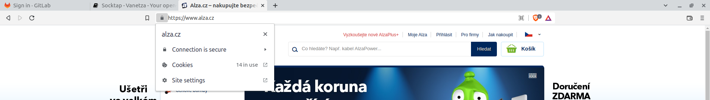
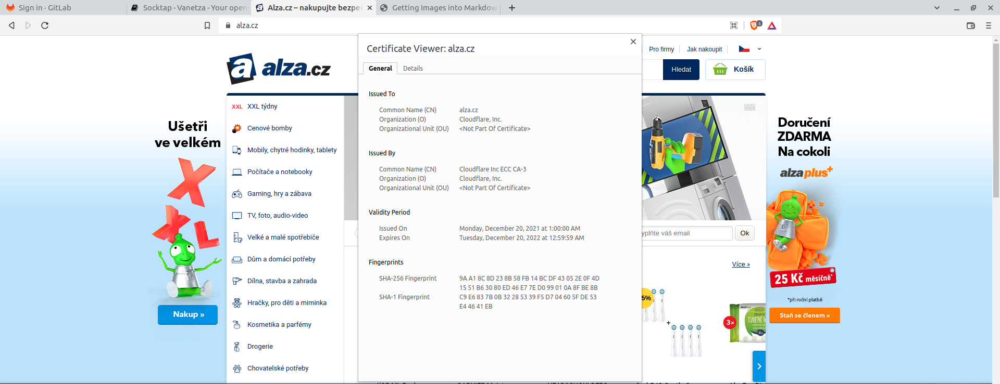

# Certificate validity check

### Summary
In order to verify web page's identity, a certificate of the web service is issued by a Certificate Authority (CA).
This certificate then ensures that the server's identity is correct and web browser can check if the user is communicating with the correct service.
Certificate has many parameters which are signed by the CA.
One of mandatory parameters are **certificate validity** and the **Common Name (CN)** to which web service is the certificate issued to.
Both of these parameters have to be correct in order to verify server's identity.

### Prerequisites
1. Use any web browser supported by the web page,
2. Use secured connection to the web page (HTTPS).

## Steps
| Step                                                                     | Data                                                                                                                                              | Expected result                                                 |
|--------------------------------------------------------------------------|---------------------------------------------------------------------------------------------------------------------------------------------------|-----------------------------------------------------------------|
| Open the web page                                                        | https://www.alza.cz/                                                                                                                              | Site is loaded                                                  |
| See the lock on the left side of the browser's URL search bar            |                                                                                       | The lock is available                                           |
| Click on the lock                                                        |                                                                                                                                                   | Menu of the lock is shown                                       |
| Depending on the web browser click through to the web page's certificate | In Brave web browser: _"Connection is secure" -> "Certificate is valid"_   | Certificate is shown                                            |
| Check certificate's validity date and time                               | _Issued On/Expires On_ parameters                                                                                                                 | Today's date is within the certificate's date and time validity |
| Check certificate's Common Name                                          | _Common Name (CN)_ parameter                                                                                                                      | CN matches the domain in the web browser's URL bar              |